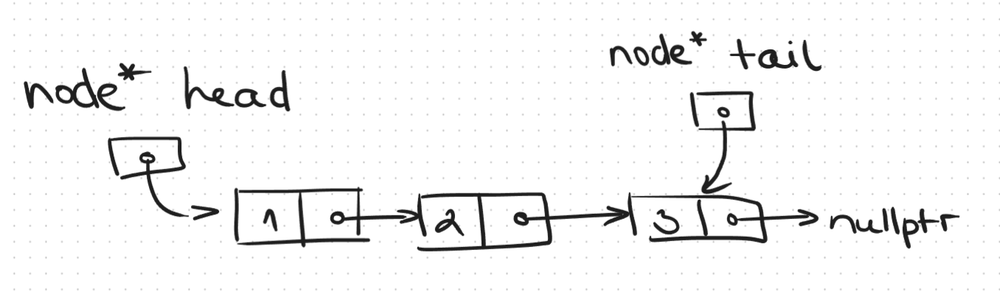
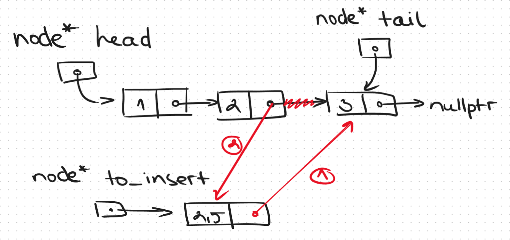
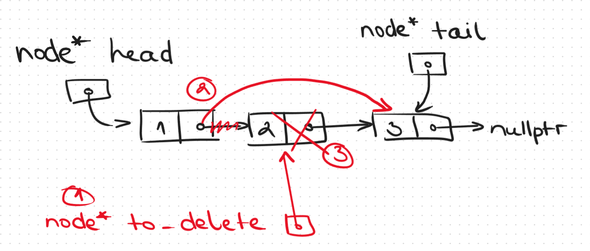

# Linked Lists
## Singly Linked List

- Указателят към последния елемент е опционален
    - Позволява ни лесно добавяне/конкатенация/четене в края
- Всеки елемент съдържа указател към следващия
- Достъпваме елемент чрез предходния му
- Всеки елемент се заделя динамично, разположени са непоследователно в паметта
- Операциите за добавяне/премахване на елемент от списъка са ефикасни, защото не се налага преоразмеряване на контейнера или местене на останалите елементи
    
    

| Операция | Сложност |
|---|---|
| Достъпване на първия/последния елемент | О(1) |
| Достъпване на произволен елемент | О(n) |
| Обхождане | O(n) |

# Iterators
- Начин да обикаляме колекция от елементи
- Съдържа се в класа-колекция
- Полезни са за типове, които нямат система за индексиране, напр. списък, множество, дърво
- Поддържат операции, подобни на аритметиката с указатели
```c++
std::vector<int> values = {1,2,3,4,5};
for(int i = 0; i < values.size(); ++i) 
    std::cout << values[i] << std::endl;

// range-based for
for(int value : values)
    std::cout << values << std::endl;

// Това всъщност се крие зад горния синтаксис?
for(std::vector<int>::iterator it = values.begin(); it != values.end(); ++it) 
    std::cout << *it << std::endl;
```
- `vector` ни предоставя итератори `begin` и `end`, сочещи към конкретни позиции
- `end` е невалидната позиция след последния елемент

### Операции
| Някои възможни операции | Ефект от операцията |
|---|---|
|`it++`||
|`++it`||
|`it--`||
|`--it`||
|`it + <int>`| Местим итератора с `<int>` позиции напред |
|`it - <int>`| Местим итератора с `<int>` позиции назад |
|`it1 - it2`| Вадим един итератор от друг, за да намерим разстоянието м/у тях |
|`it1 == it2`||
|`it1 != it2`||
|`it1 < it2`||
|`it1 <= it2`||
|`it1 > it2`||
|`it1 >= it2`||

### Видове
| Вид | Операции |
|---|---|
| Forward Iterator | Дереференциране, увеличаване, сравнение |
| Bidirectional Iterator | Дереференциране, увеличаване, намаляване, сравнение |
| Random-access Iterator | Всичко, което указателите позволяват |

# Задачa
Даден е двоичен файл, в който е записана информация за книгите в библиотека. За всеки автор във файла е записана следната информация:   
- <Имена на автора> *(символен низ в точно 30 байта)* <Брой книги> *(цяло 32 битово число без знак)*.   
- Тя е последвана от указания брой записи за книги, като всеки запис за книга съдържа:
    - <Година на издаване> *(символен низ в точно 4 байта)* <Име на книга> *(символен низ в точно 30 байта)*. 

- Да се организира картотека на книгите в библиотеката, като информацията от двоичния файл се прочете и се запише в свързан списък от автори. В записа за всеки автор се включва информация за името на автора и списък от неговите книги. 
- Картотеката трябва да се поддържа организирана по азбучен ред на авторите, за да може да се осъществява по-бързо търсене по името на автора.
- Да се напише функция, която обработва списъка от автори с помощта на указател към филтрираща функция (предикат), подаден като аргумент. 
- Списъкът, съдържащ записите, които НЕ отговарят на условието на филтриращата функция, да се запише в текстов файл със следния формат:     
    - <Имена на автора> <Брой книги>
    - Следват данни за указания брой книги в следния формат, като данните за всяка книга на даден автор са на отделен ред:
        - <Година на издаване> <Име на книга>  *(Годината на издаване се записва на поле с дължина 8, подравнена в дясно.)*
    
```
J. R. R. Tolkien 2
   1937 The Hobbit
   1954 The Fellowship of the Ring
George R. R. Martin 2
   1996 A Game of Thrones
   1999 A Clash of Kings
```
