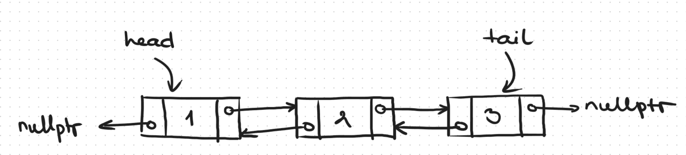
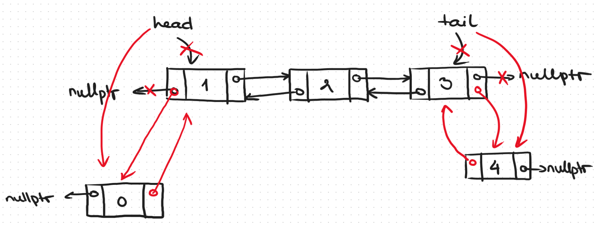
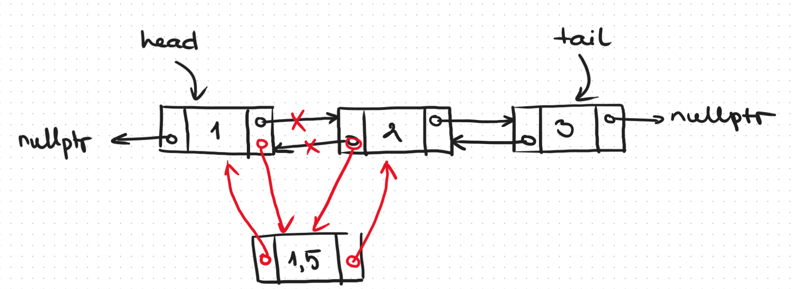
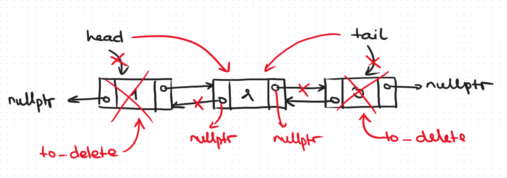
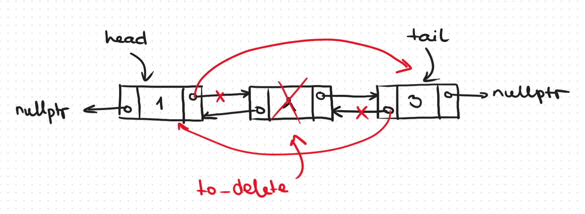

# Doubly Linked List
- Всеки елемент съдържа указател към предния **и** към следващия елемент
    
    ```c++
    template <typename T>
    struct node{
        T data;
        node* prev;
        node* next;
    }
    ```
- Можем да достъпим даден елемент чрез този преди него или чрез този след него в списъка
- Представляват симетрична структура, ако разаменим `head` с `tail` и `prev` с `next`, поведението трябва да е същото
- Всеки елемент е самодостатъчен (не е нужно да го достъпваме чрез предшественика му) за операции със себе си
- `x -> prev -> next == x` и `x -> next -> prev == x` е изпълнено за всички елементи без `head` и `tail`  
- В `STL`: `std::list` е двусвързан, `std::forward_list` е едносвързан

### Добавяне в началото/края

### Добавяне на произволно място

### Премахване от началото/края

### Премахване от произволно място


# Merge Sort
```c++
// Разделяме списъка горе-долу по средата
void split(node* list, node*& left, node*& right) {
	if (!list)
		return;

	if (left || right)
		throw std::invalid_argument("Left or right list isn't empty");

	node* slow = list;
	node* fast = list->next;

	while (fast && fast->next) {
		fast = fast->next->next;
		slow = slow->next;
	}

	left = list;
	right = slow->next;
	slow->next = nullptr;
}

// Получаваме два сортирани списъка и искаме да ги слеем, така че елементите им също да са сортирани
node* merge_sorted(node* left, node* right) {
	if (!left) // Ако нямаме ляв списък, няма какво да редим - десният си е сортиран
		return right;
	
	if (!right) // Ако нямаме десен списък, няма какво да редим - левият си е сортиран
		return left;

	node* res = nullptr;

    // Ако първият елемент на левия списък е по-малък, той пръв влиза в слетия списък
	if (left->data < right->data) {
		res = left;
        // Пускаме за нареждане останалата част от левия списък и целия десен
		res->next = merge_sorted(left->next, right);
	}
    // Ако елементът на десния списък е по-малък, той пръв влиза в слетия
	else {
		res = right;
        // Пускаме за нареждане целия ляв списък и останалата част от десния
		res->next = merge_sorted(left, right->next);
	}

	return res;
}

 // Реализираме merge sort
void merge_sort(node*& list) {
    // Ако списъкът е с 0 или 1 елемента, той си е сортиран
	if (!list || !list->next)
		return;

	node* left = nullptr;
	node* right = nullptr;

    // Разделяме списъка на две половини
	split(list, left, right);

    // Сортираме ги поотделно
	merge_sort(left);
	merge_sort(right);

    // Сливаме двете сортирани половини
	list = merge_sorted(left, right);
}
```

# Задачи
- Реализирайте методите `insert_at`, `peek_at`, `pop_at` за двусвързания списък
- Реализирайте методите `split` и `merge` за двусвързания списък
- Реализирайте `merge sort` за двусвързан списък
- Реализирайте `Deque` чрез двусвързан списък
