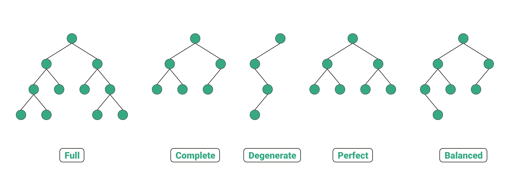

# Дървeта
## Основни компоненти/факти
- Всеки елемент има *точно един* родител, освен `корена`
- `Листо` - елемент, който няма деца
- `Път до елемент` - за всеки елемент съществува единствена последователност от свързани елементи от корена до този елемент
- `Дълбочина на елемент` - броя ребра в пътя от корена до съответния елемент
- `Височина на дървото` - дължината на пътя от корена до най-дълбокото листо
- `Ниво` - всички елементи с еднаква дълбочина
- `Разклоненост на елемент` - броя на преките наследници
- `Разклоненост на дърво` - най-голямата срещана разклоненост на елемент
    - Ако е фиксирана максимално да е `N`, то дървото е `регулярно от ред N`/`N-ично дърво`
- Максималният брой елементи на дадено ниво е `N^l`, *където `N` е регулярността, а `l` е нивото*
- `Тегло` - брой елементи в дървото
- Дърво с `N` елемента и разклоненост `k` има височина от порядъка на **О(log<sub>k</sub>N)**

## Представяне на дърво с произволна разклоненост
```c++
template <typename T>
struct node {
    T data;
    vector<node*> children;
}
```
```c++
template <typename T>
struct node {
    T data;
    LinkedList<Tree<T>> children;
}
```
```c++
// left-child, right-sibling
template <typename T>
struct node {
    T data;
    node* child;
    node* sibling;
}
```

## Представяне на двоично дърво
```c++
template <typename T>
struct node {
    T data;
    node* left;
    node* right;
}
```


## [Видове дървета](https://towardsdatascience.com/5-types-of-binary-tree-with-cool-illustrations-9b335c430254)

- `Попълнено двоично дърво` - всяко ниво, евентуално без последното, трябва да има максималния за него брой елементи и ако листата на дървото се намират на 2 нива, то листата на последното ниво са максимално наляво
- `Балансирано дърво` - разликата във **височините** на лявото и дясното поддърво на всеки връх е най-много единица
- `Идеално балансирано дърво` - разликата в **броя на възлите** на лявото и дясното поддърво на всеки връх е най-много единица

## Задачи
### Задачa 1
Напишете метод, който да принтира елементите на двоично дърво в последователност:
- `in-order` *(left, root, right)*
- `pre-order` *(root, left, right)*
- `post-order` *(left, right, root)*

### Задачa 2
Напишете метод `trim` за двоично дърво, който да премахва всички листа в дървото.

### Задачa 3
Напишете метод `bloom()`, който заменя всяко листо със следното дърво:
```
    x
   / \
  x   x

// x е стойността на самото листо
```

### Задачa 4
Напишете метод за дървото с произволна разклоненост, който намира и връща коефициента му на разклоненост.

### Задачa 5
Напишете метод за дървото с произволна разклоненост, който получава аргумент `level` и принтира елементите от това ниво.

### Задачa 6
Напишете метод за дървото с произволна разклоненост, който връща броя на листата в дървото.
