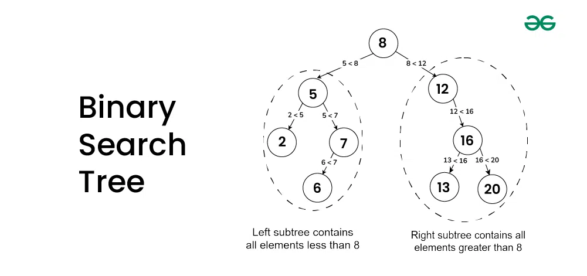

# Двоично дърво за търсене

**Двоично дърво за търсене** e двоично дърво, в което за всеки елемент:     
- всички елементи в лявото му поддърво са по-малки от него  
- всички елементи в дясното му поддърно са по-големи от него           

*Празното дърво също е двоично наредено дърво!*      

# Задача
Напишете програма, която получава низ в следния формат
`(10(7(2()())(8()()))(12(11()())(15()())))`, където:
- `()` е празното дърво
- `(x(<left_subtree>)(<right_subtree>))`, като `x` е цяло число - стойността на корена

По този вход, програмата запълва двоично наредено дърво и:
- изкарва елементите в нарастващ ред
- изкарва елементите в намаляващ ред
- намира сумата на всички елементи
- прилага подадена функция върху всички елементи *(т.е. трябва да напишете функция `map`)*
- при подадено число `n`, извежда колко поддървета съдържат точно `n` елемента
